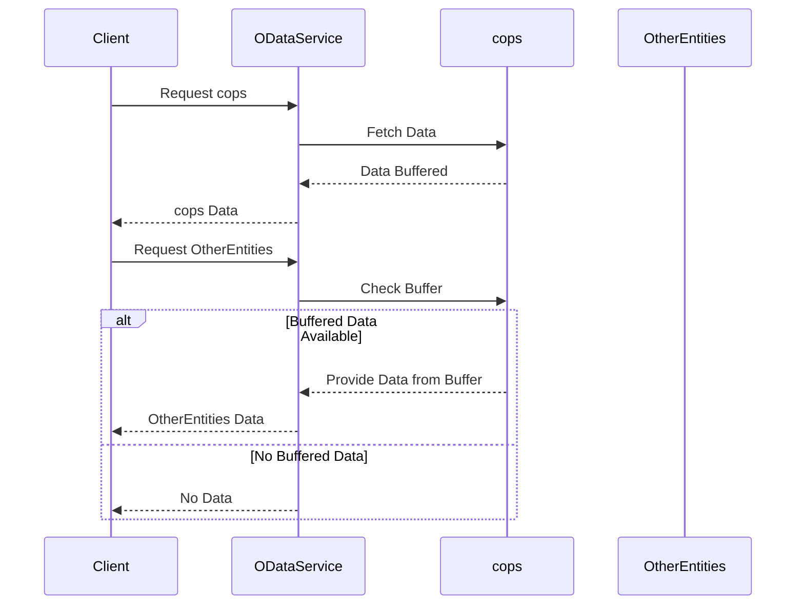
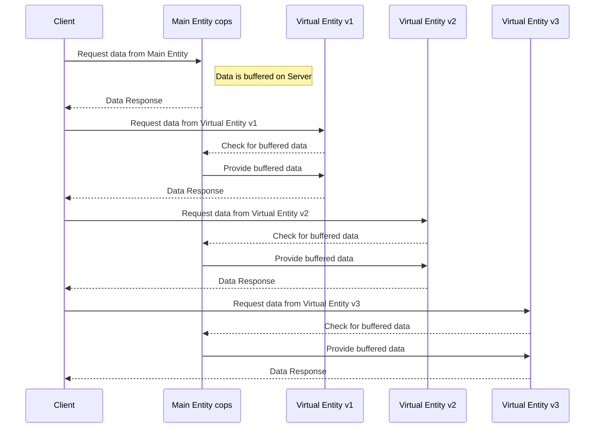

#Include DrawIo directly

Do the same with mermaid:

```mermaid
sequenceDiagram
    participant Client
    participant ODataService
    participant cops
    participant OtherEntities

    Client->>ODataService: Request cops
    ODataService->>cops: Fetch Data
    cops-->>ODataService: Data Buffered
    ODataService-->>Client: cops Data

    Client->>ODataService: Request OtherEntities
    ODataService->>cops: Check Buffer
    alt Buffered Data Available
        cops-->>ODataService: Provide Data from Buffer
        ODataService-->>Client: OtherEntities Data
    else No Buffered Data
        ODataService-->>Client: No Data
    end
```

A little bit different visaulization:

```mermaid
sequenceDiagram
    participant Client
    participant cops as Main Entity cops
    participant v1 as Virtual Entity v1
    participant v2 as Virtual Entity v2
    participant v3 as Virtual Entity v3

    Client->>cops: Request data from Main Entity
    Note right of cops: Data is buffered on Server
    cops-->>Client: Data Response

    Client->>v1: Request data from Virtual Entity v1
    v1-->>cops: Check for buffered data
    cops->>v1: Provide buffered data
    v1-->>Client: Data Response

    Client->>v2: Request data from Virtual Entity v2
    v2-->>cops: Check for buffered data
    cops->>v2: Provide buffered data
    v2-->>Client: Data Response

    Client->>v3: Request data from Virtual Entity v3
    v3-->>cops: Check for buffered data
    cops->>v3: Provide buffered data
    v3-->>Client: Data Response
```
