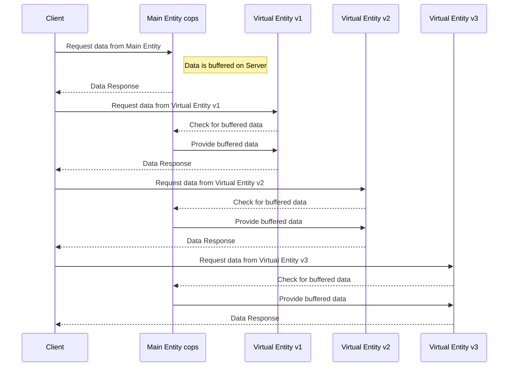
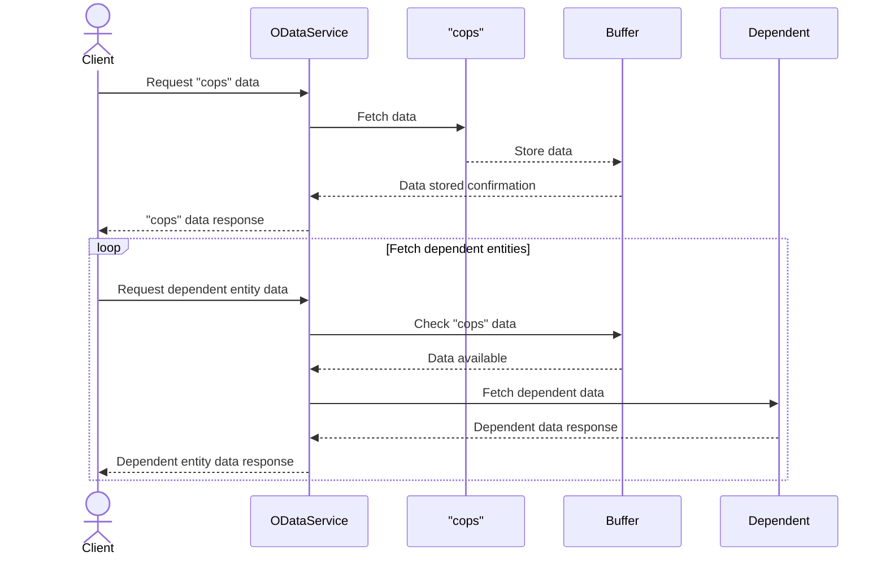
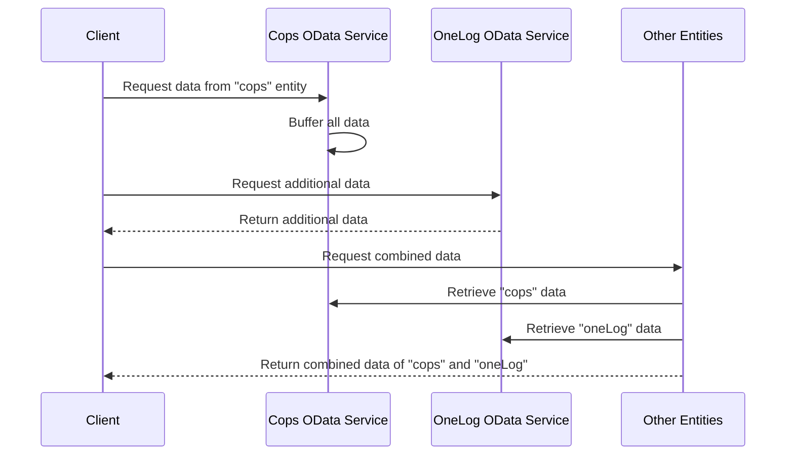

# Mermaid and excalidraw.com

Those picture were generated by [excalidraw](excalidraw.com)

I entered this prompt:

_I like to visualize the logic behind an odata service.I have a main entity cops and a virtual entity v1,v2 and v3.
It is necessary to call the main entity xyz before the entities v1,v2 and v3 will return anything. The call to the main entity xyz buffers all the data on the server. I need this as a sequence diagram._

and got:

_I have an odata service with a main entity "cops" and further entities that depend on "cops". It is necessary to call the main entity before the other entities will return anything. The call to cops buffers all the data on the server. I need this as a sequence diagram._

_An odata service has a main entity "cops" and further entities that depend on "cops". It is necessary to call the main entity before the other entities will return anything. The call to "cops" buffers all the data on the server. After the data is buffered the system calls an external odata service "oneLog" to read additional data. The other entities will return a combination of "cops" and "oneLog". I need this as a sequence diagramm._

